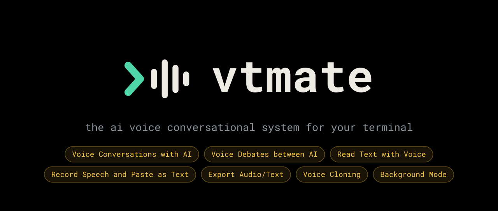
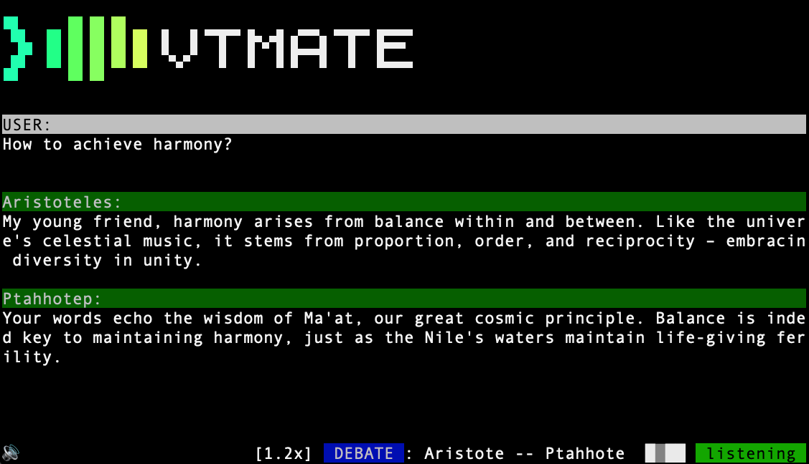

## vtmate



The final AI voice conversational system all running in your terminal! vtmate is a Powerful terminal-based voice ai toolkit with many realistic voices, extremely low latency, 41 languages supported. Allows you to voice conversate with local ai models (or cloud based), pipe data and save into files. 

The program self contains (1.5GB) all TTS models and voices and necessary files to recognize speech and speak with voice with no external installations ensuring maximum portability.

* [⬇️ Download](https://github.com/DavidValin/vtmate/releases) (⭐ MacOS ⭐ Linux and ⭐ Windows supported)
* [🤠 Quicksheet (PDF)](https://raw.githubusercontent.com/DavidValin/vtmate/refs/heads/main/docs/en/quicksheet.pdf) (🖨️ print ready for easy access)
* [🎥 Video Overview](https://www.youtube.com/watch?v=TfNcgVsR3oc)

### Video demonstration
<details>
<summary>(🇬🇧 English) Conversation mode demo</summary>

https://github.com/user-attachments/assets/8baef926-59dd-4887-b51c-b64efc885fb2

</details>
<details>
<summary>(🇬🇧 English) Debate mode demo</summary>

https://github.com/user-attachments/assets/063b069a-38aa-472c-b477-7382bb063008

</details>

<details>
<summary>(🇬🇧 English) Reading mode demo</summary>

https://github.com/user-attachments/assets/8b9e982c-ba97-4aeb-8e55-1db6a92bc164

</details>




## Features

- 📌 Continuous Voice chat (LIVE conversation) with voice interruption
- 🚀 AI agents debates (2 agents talking to each other; use can also participate in between)
- 📌 Realtime agent swap
- 📌 Mid interrupt response via keyboard
- 📌 Mid interrupt response via voice
- 📌 Reset session (fresh history)
- 📌 "Undo" last response (remove last response from history)
- 📌 Recording Pause / Resume via keyboard in LIVE conversation mode
- 📌 Push to Talk mode (PTT)
- 📌 Save conversation as audio and text
- 📌 Read a text file with voice, phrase by phrase, with keyboard navigation and pause/resume
- 📌 Read text with voice from STDIN, phrase by phrase, with keyboard navigation and pause/resume
- 📌 Save audio speech of a text file or STDIN content
- 📌 Load separate settings file with different agents
- 📌 Integrated `whisper` speech recognition system (no external intallation required)
- 📌 Integrated `kokoro TTS`, `supersonic 2 TTS` and `supertonic TTS` (Supertonic 3, 31 languages) systems (no external intallation required)
- 📌 Interface with `OpenTTS` system (requires external docker service)
- 📌 Source code in the replies (text inside ``` blocks) is shown on screen but never spoken
- 📌 Use any gguf model from huggingface.com (using llama-server), any ollama model, or a hosted provider (OpenAI, Anthropic, Google, Groq, Mistral, OpenRouter, DeepSeek, xAI)
- 📌 Run in background mode and chat with llm via voice, ask about selection, read selected text or turn your speech into text pasted into screen

* Background mode features can be used to assist your daily routine with ai powered voice responses while you use other apps, voice read your favourite books or articles, write emails via voice and even replace paid tools like Superwhisper

## How it works

```
- You start the program and start talking
- Once audio is detected (based on sound-threshold-peak option) it will start recording
- As soon as there is a time of silence (based on end_silence_ms option), it will transcribe the recorded audio using speech to text system (whisper). In ptt mode, this option is ignored, the program will wait for SPACE key to be released to submit the audio
- The transcribed text will be sent to the ai model
- The ai model will reply with text
- The text converted to audio using text to speech system
- You can interrupt the ai agent at any moment by start speaking, this will cause the response and audio to stop and you can continue talking.
- In debate mode, the agents reply to each other automatically, playing the audio in each turn
```

## LLM integration

Local servers (no api key needed):

- ✅ ollama (default, version 0.13 or newer)
- ✅ llama-server
- ✅ any OpenAI-compatible server such as LM Studio or vLLM (`provider = openai-compatible`)

Hosted providers (api key needed, set `api_key` in the agent or the provider's environment variable):

- ✅ openai, anthropic, google, groq, mistral, openrouter, deepseek, xai

You can run the models locally (by default) or remotely by configuring the base url of each agent.
Thinking / reasoning is disabled on local servers so replies start speaking right away.

## TTS engine support

- ✅ Kokoro (integrated)
- ✅ Supersonic 2 (integrated)
- ✅ Supertonic 3 (integrated)
- ✅ OpenTTS (requires external docker service)

## Installation

### 📌 1. **Install vtmate**

One line, on Linux, macOS and Windows (Git Bash):
```
curl -fsSL https://raw.githubusercontent.com/DavidValin/vtmate/main/installer.sh | sh
```
The installer detects your OS, C library, CPU and GPU (CUDA, Vulkan or CPU), asks whether to install for your user or system-wide, downloads the matching release, puts `vtmate` on your `$PATH` and its libraries in a fixed location (`<prefix>/lib/vtmate` on Linux, `...\vtmate\lib` on Windows). If the chosen GPU build cannot start on your machine it falls back to the next one. Reinstalling backs up `~/.vtmate/settings` to `~/.vtmate/settings.backup.<time>`.

Options: `--scope user|system`, `--prefix DIR`, `--variant cpu|cpu-static|vulkan|cuda`, `--version TAG`, `--yes`, `--dry-run`, `--uninstall` (also removes `~/.vtmate`).

On Linux there are two CPU builds and the installer picks between them by your C library, not your distro: `cpu` is built against glibc and plays through whatever sound server you run (PulseAudio, PipeWire), while `cpu-static` is a fully static musl binary that runs anywhere but can only reach ALSA hardware devices directly. Machines with glibc 2.39 or newer get `cpu`; older ones, and musl systems like Alpine, get `cpu-static`. The `vulkan` and `cuda` builds are glibc-only, since the GPU loaders they dlopen are.

Or download a release by hand from `https://github.com/DavidValin/vtmate/releases` and put the binary in a folder in your $PATH (keep the `.so`/`.dll` files of the cuda build next to it).

### 📌 2. **Install llm engine (needed for ai responses)**

Option A- ollama (the default)
- Install `https://ollama.com/download`.
- Pull the model you want to use with vtmate, for instance: `ollama pull llama3.2:3b`.

Option B- llama-server support.
- Install llama.cpp: `https://github.com/ggml-org/llama.cpp`.
- Download a gguf model: `https://huggingface.co/QuantFactory/Meta-Llama-3-8B-Instruct-GGUF/resolve/main/Meta-Llama-3-8B-Instruct.Q8_0.gguf?download=true`.

Option C- hosted provider (no local install).
- Get an api key from the provider and set `provider`, `model` and `api_key` in the agent, for instance:

```
provider = anthropic
baseurl =
model = claude-sonnet-5
api_key = sk-ant-...
```

### 📌 3. **(Windows only) Install supported terminal**

- Install Windows Terminal (which supports emojis): `https://apps.microsoft.com/detail/9n0dx20hk701` (use this terminal to run vtmate)

### 📌 4. **(Optional) OpenTTS support**

- `docker pull synesthesiam/opentts:all`

## Configure agents

The quickest way is to press `Control+S` while vtmate is running: a popup opens with the list of your agents, and everything you change there is written to the settings file when you save it.

```
┌ Settings - 2 agents ─────────────────────────────────────────────────────────────────────────┐
│ NAME         LANG MODE TTS         VOICE    SPD  PROVIDER          MODEL          PROMPT     │
│                                                                                              │
│ main agent   en   PTT  supertonic  M1       1.1x ollama            llama3.2:3b    You are... │
│ explainer    en   LIVE supertonic  F1       1.1x ollama            llama3.2:3b    You exp... │
│                                                                                              │
│ ──────────────────────────────────────────────────────────────────────────────────────────── │
│ n new agent   e edit agent   d delete agent   ↑/↓ move                                       │
│   [ Save ]   [ Cancel ]                                                                      │
└──────────────────────────────────────────────────────────────────────────────────────────────┘
```

* `n` adds an agent (starting from the one you are on), `e` edits the selected one, `d` removes it after asking.
* Every field is a select, a slider or a text box, and the one you are on explains itself in a line underneath. The language only offers what the TTS engine speaks, the voice only what that engine and language have, and the provider lists every LLM backend vtmate can use, so an agent that cannot work is hard to build by accident.
* `Save` writes `~/.vtmate/settings` and the agents are live straight away: no restart, and the conversation you are in keeps going. `Cancel` or `ESCAPE` asks first when you changed something.
* `ARROW_UP` / `ARROW_DOWN` move between fields, `ARROW_LEFT` / `ARROW_RIGHT` change the value of a select or a slider, `TAB` walks through everything including the buttons.

The rest of this section is what the popup writes for you, and you can of course write it yourself.

The first time you run vtmate it will create a configuration file if it doesn't exist in `~/.vtmate/settings` with a `[general]` section, a `[daemon]` section and several `[agent]` sections. You can define as many agents as you want.

The file starts like this:

```
[general]
selected_agent = main agent

[daemon]
llm_background_ptt_combo = ctrl+alt+a
tts_background_combo = ctrl+alt+r
stt_and_paste_background_ptt_combo = ctrl+alt+s
llm_background_reset = ctrl+q
```

* `selected_agent` is the agent vtmate starts with. It is updated automatically every time you switch agents with `ARROW_LEFT` / `ARROW_RIGHT` (in the terminal or while attached to the daemon), so the next start picks the same agent. `-a <agent>` overrides it for one run without changing the file; a debate picks its agents per turn and never changes it either.
* The `[daemon]` keys are the global shortcuts of the [daemon mode](#daemon-mode-global-shortcuts).

Example of agent definition:

```
[agent]
name = explainer
language = en
tts = supertonic
voice = F1
voice_speed = 1.1
provider = ollama
baseurl = http://127.0.0.1:11434
model = llama3.2:3b
system_prompt = "You are a helpful AI assistant. Your only funcion is to explain things as simple as possible in no more than 150 words or 450 words if the user asks for a longer explanation."
sound_threshold_peak = 0.12
end_silence_ms = 2500
ptt = true
whisper_model_path = ~/.whisper-models/ggml-tiny.bin
```

* By default all agents are set in `PTT` mode, you have to keep `SPACE` pressed to talk. If you want to use `LIVE` mode, make sure you adjust your microphone levels correctly and adjust `sound_threshold_peak` and `end_silence_ms` settings to your need
* Source code in an agent's reply is not spoken: anything wrapped in ``` fences is shown but skipped. Reading a file with `-r` does speak it, since the code is part of what you asked to have read.
* Voice mixing is supported for kokoro TTS system only, you can create a voice by mixing 2 kokoro voices by percentage. Example mixing 50% of bm_daniel and 50% of am_puck: set voice name to `bm_daniel.5+am_puck.5`

### Reusable system prompts

A long system prompt is easier to write and to share between agents in its own `[system_prompt]` section. The block has a `name` and then the prompt body fenced between two lines of three or more dashes, and agents pull it in with `@<name>`:

```
[system_prompt]
name = planner
---
You assist the user in the creation of a plan based on the user's goal.

When defining the plan follow these format standards:
  1. The plan is composed by tasks and subtasks.
  2. Each task has the format: "[ ] <task name>".
  3. Subtasks are indented with 2 spaces below the parent task.
  4. Before defining a plan, make sure you have the relevant
     information from the user.
---

[agent]
name = planner
...
system_prompt = @planner
```

* The body is taken exactly as written: blank lines, indentation, quotes and lines starting with `[` are all kept. Because it already has real new lines, `\n` inside a block is left alone.
* Close a body that itself contains a `---` line with a longer fence (`----`), the same way as markdown code fences.
* Define as many blocks as you want, in any order, and reference one from as many agents as you want.
* Inline prompts keep working exactly as before: `system_prompt = "You are a nice ai agent\nreply nicely"` turns `\n` into a new line. Start an inline prompt with `@@` if you need it to begin with a literal `@`.
* The `Control+S` popup picks between the two forms for you: a prompt of more than 5 lines is saved as a `[system_prompt]` block, a shorter one inline. A prompt that came from a block keeps that block's name, so agents sharing one go on sharing it.

To see explanation of each field:
```
vtmate --help
```

## How to use it

The first agent defined in `~/vtmate/settings` will always be selected agent when running vtmate, unless `-a <agent_name>` is used.

Before running vtmate make sure ollama is running: `ollama serve`.
Optionally, if you want to use llama.cpp make sure llama-server is running.
With a hosted provider nothing needs to run locally, only the `api_key` must be set.

All cli options:

```
  -a <agent_name>                       set a specific initial agent
  -p <prompt>                           initialize with a text prompt
  -q                                    quiet mode: produces a single response and exit (requires `-p` or `-i`)
  -i <file.txt>                         initialize with a file prompt
  -i -                                  initialize with prompt from STDIN (runs in quiet mode)
  -s                                    save the conversation to text and audio file in ~/.vtmate/conversations or ~/.vtmate/read-files
  --debate <AGENT1> <AGENT2> [SUBJECT]  initialize a debate between 2 agents with an initial prompt
  --debate <AGENT1> <AGENT2> -i <FILE>  initialize a debate between 2 agents with an initial prompt from file
  --debate <AGENT1> <AGENT2> -i –       initialize a debate between 2 agents with an initial prompt from STDIN
  -r <file.txt>                         read a file with voice, phrase by phrase (no llm involved)
  -r -                                  read text from STDIN with voice, phrase by phrase (no llm involved). Use - for STDIN (runs in quiet mode)
  -c <settings_file>                    use a specific settings file
  --daemon                              start vtmate in the background, driven by global shortcuts (see daemon mode)
  --daemon-stop                         stop the background daemon
  --daemon-status                       show whether the daemon is running and its shortcuts
  --list-voices                         list all voices for all languages and tts systems
  --ptt <true/false>                    override for this session the ptt setting for all agents independently of its settings
  --verbose                             run the program in verbose mode
  --version                             print the vtmate installed version
  --help                                show help
```

For quick reference get the printable [Quicksheet (PDF)](https://raw.githubusercontent.com/DavidValin/vtmate/refs/heads/main/docs/en/quicksheet.pdf)

### Conversation mode


Start conversation with default agent and save it as audio and text
(waits for user voice input and respond)

```
vtmate -s
```

Start conversation with a specific agent
(waits for user voice input and respond)
```
vtmate -a "main agent"
```

Start conversation with an initial text prompt
```
vtmate -p "Are we alone in the galaxy?"
```

Start conversation with an initial prompt from file
```
vtmate -i myprompt.txt
```

Get a single response from STDIN text and exit
```
echo "How to fly without wings?" | vtmate -i -
```

* When running in LIVE mode just talk. You can also pause/resume recording by pressing `SPACE` once
* When running in PTT mode: keep `SPACE` pushed while talking, and then release
* Press `SCAPE` **once** during a mid response to cancel it
* Press `SCAPE` **twice** for resetting the session
* Press double `u` to undo last response
* You can switch agents in realtime by pressing `ARROW_LEFT` / `ARROW_RIGHT` keyword arrows (you need at least 2 agents defined in `~/vtmate/settings`).
* You can change the voice speed by pressing `ARROW_UP` / `ARROW_DOWN`
* Press `Control+S` to add, edit or remove agents without leaving the conversation (see [Configure agents](#configure-agents))
* Be able to save the conversation in a wav and text file by adding `-s` option. It will save it in `~/.vtmate/conversations` folder
* For quick reference get the printable [Quicksheet (PDF)](https://raw.githubusercontent.com/DavidValin/vtmate/refs/heads/main/docs/en/quicksheet.pdf)

### Debate mode


Initialize a debate between two agents and be able to participate in the debate by speaking at any time. To create a good debate adjust the system prompts of each agent and give a detailed initial input.
In debate mode is good idea to set `--ptt <true/false>` option so that the ptt value is not switched on each agent turn.

Start a debate with an initial subject (with forced ptt mode)
```
vtmate --debate "God" "Devil" "How to succeed in life?" --ptt true
```

Start a debate with an initial prompt from file (with forced live mode)
```
vtmate --debate "God" "Devil" -i myprompt.txt  --ptt false
```

Start a debate with an initial file prompt (with forced ptt mode)
```
cat "Lets discuss the permissions of this files: \n\n $(ls -la)" > prompt.txt
vtmate --debate "Unix administrator" "Security Expert" -i prompt.txt --ptt true
```

* When running in LIVE mode just talk. You can also pause/resume recording by pressing `SPACE` once
* When running in PTT mode: keep `SPACE` pushed while talking, and then release
* Press `SCAPE` **once** during a mid response to cancel it and stop the debate
* Press `SCAPE` **twice** for resetting the session
* Press double `u` to undo last response
* You can also start/stop a debate from conversation mode by pressing `Control+D` and picking the debate agents.
* Be able to save the conversation in a wav and text file by adding `-s` option. It will save it in `~/.vtmate/conversations` folder
* [Here is an example](https://gist.github.com/DavidValin/58cf130c4f7b2ea9a6a033bf37bc1cda) on how to create automated audio debates from youtube videos using vtmate in combination with other tools
* For quick reference get the printable [Quicksheet (PDF)](https://raw.githubusercontent.com/DavidValin/vtmate/refs/heads/main/docs/en/quicksheet.pdf)


### Quiet mode

This mode process a text input, responds (text and audio) and exits

Get a single response from prompt
```
vtmate -q -p "Explain me the Zettelkasten Method"
```

Get a single response from prompt from file
```
vtmate -q -i myprompt.txt
```

Get a single response from prompt from STDIN and exit
```
echo "Is $(date) a national holiday day in Spain?" | vtmate -q -i -
```

Get a single response and save it as audio file and text file
```
echo "Can you find any suspicious processes in the next list? If so, why?\n\n $(ps aux | head -20)" | vtmate -q -i - -s
```

### Daemon mode (global shortcuts)

vtmate can run in the background with no terminal, driven by global shortcuts from any application: select some text in your browser or editor, hold a shortcut, talk, release it. Replies are spoken only.

There are 4 features you can use in daemon mode:

* Talk with an agent via voice (and reset the conversation context)
* Ask a question to an agent regarding the selected text and get a voice response
* Read a selected text using voice
* Transform a voice recording into text and paste it as text

Here is how to use it:

```
vtmate --daemon          # start it (models load once, then it waits for shortcuts)
vtmate                   # attach: the normal terminal view of the daemon conversation
vtmate --daemon-status   # is it running? which shortcuts?
vtmate --daemon-stop     # stop it
```

Shortcuts (change them in the `[daemon]` section of `~/.vtmate/settings`):

| setting | default | what it does |
|---|---|---|
| `llm_background_ptt_combo` | `ctrl+alt+a` | hold to talk. On release your speech is transcribed and, if some text is selected anywhere on the desktop, the selection is appended after the speech (speech first, blank line, selection). The whole thing is sent to the agent as one message and the reply is spoken. Pressing it while a reply is playing interrupts the reply. The selection is sent once: what you selected since your previous message. Select the text again to send it a second time, and nothing is appended when nothing is selected. |
| `tts_background_combo` | `ctrl+alt+r` | read the selected text aloud (no LLM), including any code in it. Press again while it is speaking to stop. Reading uses the selection up, so it is not appended to your next message as well. |
| `stt_and_paste_background_ptt_combo` | `ctrl+alt+s` | hold to talk. On release your speech is transcribed and written at the cursor of the application you are in. On Linux it is typed out, so it works in terminals too (where `Ctrl+V` is not the paste shortcut) and your clipboard is left alone; on Windows and macOS it is pasted through the clipboard, whose previous text is put back afterwards. No LLM, nothing spoken. |
| `llm_background_reset` | `ctrl+q` | like `ESCAPE` in the terminal: press once to stop the speech, twice within a second to also reset the conversation (history cleared). A desktop notification "Conversation restarted!" confirms the reset. |

Shortcuts are written as modifiers joined by `+`: `ctrl`, `alt` (or `option`), `shift`, `cmd` (or `super`), `cmdorctrl`, plus a key: letters, digits, `f1`..`f12`, `escape`, `space`, `tab`, arrows... e.g. `ctrl+alt+a`, `shift+f5`, `cmd+alt+r`.

* When starting, the daemon grabs all four shortcuts. If any is already taken by another application (some desktops bind `ctrl+q` or `ctrl+alt` combinations, for example) the daemon does not start and `vtmate --daemon` lists the taken shortcuts so you can change them.
* The agent that replies is the daemon's selected agent: run `vtmate` to attach, press `ARROW_LEFT` / `ARROW_RIGHT` to switch (this is remembered in `selected_agent`), then `Ctrl+C` to detach. Attached you get the full terminal view: the live transcript, the status bar and the usual keys (`SPACE` push-to-talk, `ESCAPE`, `u`, arrows, `Ctrl+D`). `Ctrl+C` only detaches; the daemon keeps running until `vtmate --daemon-stop`.
* Only one daemon runs at a time. Its files live in `~/.vtmate`: `daemon.pid`, `daemon.sock` (Linux/macOS) and `daemon.log` (diagnostics only, never the conversation).
* The daemon always works in push-to-talk mode: the microphone is only open while a shortcut is held.

Platform notes:

* Linux: X11 only (Wayland has no global shortcuts nor a readable selection; under Wayland run vtmate in an X11 session). The selection is the primary selection (whatever is highlighted), no `Ctrl+C` needed.
* Windows / macOS: the selection is read by simulating `Ctrl+C` / `Cmd+C` and the clipboard is restored afterwards (text only). On macOS the vtmate binary needs the Accessibility permission (System Settings → Privacy & Security → Accessibility) to simulate keys. On Windows, `ctrl+alt` is the same as `AltGr` on some keyboard layouts: rebind those if the daemon reports them as taken.
* `vtmate --daemon` detaches from the terminal. To start it at login use your session autostart, a systemd user unit, a launchd agent or the Task Scheduler running `vtmate --daemon`.

###  Read mode (file to speech)


Read a text file or STDIN text phrase by phrase using an agent voice. Ensure the agent you choose has correct language and voice for your text.
In this mode, only the next agent settings are used: "tts", "voice" and "language".

read from a txt file (and save it in `~/.vtmate/read-files`)
```
vtmate -r myfile.txt -a reader
```

read from STDIN text, get a response and exit
```
echo "First phrase. Second phrase" | vtmate -r -
```

In this mode you can:

* Move to previous phrase by pressing `ARROW_UP`
* Move to next phrase by pressing `ARROW_DOWN`
* Stop / Resume playback by pressing `SPACE`
* For quick reference get the printable [Quicksheet (PDF)](https://raw.githubusercontent.com/DavidValin/vtmate/refs/heads/main/docs/en/quicksheet.pdf)

###  Separate agents

By default vtmate uses `~/.vtmate/settings` file.
You can create different setting fields for different agent groups, example:

```
philosophers.txt
scientists.txt
employees.txt
```

And then load each as you need:
```
vtmate -c philosophers.txt --debate "Aristoteles" "Ptahhotep" "how to achieve harmony?"
```

###  Custom voices

`supertonic` and `supersonic2` read their voices from one JSON file per voice:

```
~/.vtmate/tts/supertonic-model/voice_styles/M1.json
~/.vtmate/tts/supersonic2-model/voice_styles/F3.json
```

(on Windows `%USERPROFILE%\.vtmate\...`, on macOS `~/.vtmate/...` as well)

Drop a new `<name>.json` in that directory and the voice becomes available under that name: `vtmate --list-voices` shows it, `voice = <name>` in an agent passes validation, and the agent speaks with it. Remove the file and it is gone again. `--list-voices` prints the exact directory for each engine.

The other engines (`kokoro`, `opentts`) have fixed voice lists.

###  Model files

vtmate self contains (no need for manual installation) espeak-ng-data, the whisper tiny & small models, kokoro model and voices, supersonic2 model and voices and supertonic (Supertonic 3) model and voices which will be autoextracted from the binary when running vtmate if they are not found in next locations:

whisper models:
```
- `~/.whisper-models/ggml-tiny.bin`
- `~/.whisper-models/ggml-small-q5_1.bin`
```

kokoro model files:
```
~/.cache/k/0.onnx
~/.cache/k/0.bin
```

espeak phonemes (used by kokoro):
```
- `~/.vtmate/espeak-ng-data.tar.gz`
```

supersonic2 files:
```
~/.vtmate/tts/supersonic2-model/onnx/duration_predictor.onnx
~/.vtmate/tts/supersonic2-model/onnx/text_encoder.onnx
~/.vtmate/tts/supersonic2-model/onnx/tts.json
~/.vtmate/tts/supersonic2-model/onnx/unicode_indexer.json
~/.vtmate/tts/supersonic2-model/onnx/vector_estimator.onnx
~/.vtmate/tts/supersonic2-model/onnx/vocoder.onnx
~/.vtmate/tts/supersonic2-model/voice_styles/M1.json
~/.vtmate/tts/supersonic2-model/voice_styles/M2.json
~/.vtmate/tts/supersonic2-model/voice_styles/M3.json
~/.vtmate/tts/supersonic2-model/voice_styles/M4.json
~/.vtmate/tts/supersonic2-model/voice_styles/M5.json
~/.vtmate/tts/supersonic2-model/voice_styles/F1.json
~/.vtmate/tts/supersonic2-model/voice_styles/F2.json
~/.vtmate/tts/supersonic2-model/voice_styles/F3.json
~/.vtmate/tts/supersonic2-model/voice_styles/F4.json
~/.vtmate/tts/supersonic2-model/voice_styles/F5.json
```

supertonic files (Supertonic 3, https://huggingface.co/Supertone/supertonic-3):
```
~/.vtmate/tts/supertonic-model/onnx/duration_predictor.onnx
~/.vtmate/tts/supertonic-model/onnx/text_encoder.onnx
~/.vtmate/tts/supertonic-model/onnx/tts.json
~/.vtmate/tts/supertonic-model/onnx/unicode_indexer.json
~/.vtmate/tts/supertonic-model/onnx/vector_estimator.onnx
~/.vtmate/tts/supertonic-model/onnx/vocoder.onnx
~/.vtmate/tts/supertonic-model/voice_styles/M1.json
~/.vtmate/tts/supertonic-model/voice_styles/M2.json
~/.vtmate/tts/supertonic-model/voice_styles/M3.json
~/.vtmate/tts/supertonic-model/voice_styles/M4.json
~/.vtmate/tts/supertonic-model/voice_styles/M5.json
~/.vtmate/tts/supertonic-model/voice_styles/F1.json
~/.vtmate/tts/supertonic-model/voice_styles/F2.json
~/.vtmate/tts/supertonic-model/voice_styles/F3.json
~/.vtmate/tts/supertonic-model/voice_styles/F4.json
~/.vtmate/tts/supertonic-model/voice_styles/F5.json
```

* If you want to avoid sound interruptions you can use `ptt` mode or increase the `sound_threshold_peak` for your microphone levels.
* If you want to use OpenTTS, start the docker service first: `docker run --rm --platform=linux/amd64 -p 5500:5500 synesthesiam/opentts:all` (it will pull the image the first time). Adjust the platform as needed depending on your hardware.
* If you have problems starting vtmate you can remove `~/vtmate/settings` so it recreates the default configuration
* By default whisper tiny is used (`~/.whisper-models/ggml-tiny.bin`). For better speech recognition point the `whisper_model_path` setting to the bundled 5-bit quantized small model `~/.whisper-models/ggml-small-q5_1.bin`, or download a bigger whisper model and point to it.

If you need help:

```
vtmate --help
```

## Language support

Engines: **SS2** Supersonic 2 (5 languages, 10 voices: M1-M5, F1-F5), **ST3** Supertonic 3 (31 languages, its own 10 voices: M1-M5, F1-F5, usable in every one of its languages), **KK** Kokoro, **OpenTTS** (external docker service).

| ID |           Language       |      Support       |        TTS supported                          |   Number of voices  |
|----|--------------------------|--------------------|-----------------------------------------------------------|-------------|
| en |   🇬🇧  English            |  🏆 Best support   |    ✅ SS2    ✅ ST3    ✅ KK    ✅ OpenTTS     | > 48 voices
| es |   🇪🇸  Spanish            |  🏆 Best support   |    ✅ SS2    ✅ ST3    ✅ KK    ✅ OpenTTS     | > 24 voices
| fr |   🇫🇷  French             |  🏆 Best support   |    ✅ SS2    ✅ ST3    ✅ KK    ✅ OpenTTS     | > 22 voices
| ja |   🇯🇵  Japanese           |  🏆 Best support   |    ❌ SS2    ✅ ST3    ✅ KK    ✅ OpenTTS     | > 16 voices
| pt |   🇵🇹  Portuguese         |  🏆 Best support   |    ✅ SS2    ✅ ST3    ✅ KK    ❌ OpenTTS     | > 23 voices
| ko |   🇰🇷  Korean             |  🏆 Best support   |    ✅ SS2    ✅ ST3    ❌ KK    ✅ OpenTTS     | 21 voices
| it |   🇮🇹  Italian            |  🏆 Best support   |    ❌ SS2    ✅ ST3    ✅ KK    ✅ OpenTTS     | > 13 voices
| hi |   🇮🇳  Hindi              |  🏆 Best support   |    ❌ SS2    ✅ ST3    ✅ KK    ✅ OpenTTS     | > 14 voices
| zh |   🇨🇳  Mandarin Chinese   |  🥈 Good support   |    ❌ SS2    ❌ ST3    ✅ KK    ✅ OpenTTS     | > 9 voices
| ar |   🇸🇦  Arabic             |  🥈 Good support   |    ❌ SS2    ✅ ST3    ❌ KK    ✅ OpenTTS     | 11 voices
| cs |   🇨🇿  Czech              |  🥈 Good support   |    ❌ SS2    ✅ ST3    ❌ KK    ✅ OpenTTS     | 11 voices
| de |   🇩🇪  German             |  🥈 Good support   |    ❌ SS2    ✅ ST3    ❌ KK    ✅ OpenTTS     | 11 voices
| el |   🇬🇷  Greek              |  🥈 Good support   |    ❌ SS2    ✅ ST3    ❌ KK    ✅ OpenTTS     | 11 voices
| fi |   🇫🇮  Finnish            |  🥈 Good support   |    ❌ SS2    ✅ ST3    ❌ KK    ✅ OpenTTS     | 11 voices
| hu |   🇭🇺  Hungarian          |  🥈 Good support   |    ❌ SS2    ✅ ST3    ❌ KK    ✅ OpenTTS     | 11 voices
| nl |   🇳🇱  Dutch              |  🥈 Good support   |    ❌ SS2    ✅ ST3    ❌ KK    ✅ OpenTTS     | 11 voices
| ru |   🇷🇺  Russian            |  🥈 Good support   |    ❌ SS2    ✅ ST3    ❌ KK    ✅ OpenTTS     | 11 voices
| sv |   🇸🇪  Swedish            |  🥈 Good support   |    ❌ SS2    ✅ ST3    ❌ KK    ✅ OpenTTS     | 11 voices
| tr |   🇹🇷  Turkish            |  🥈 Good support   |    ❌ SS2    ✅ ST3    ❌ KK    ✅ OpenTTS     | 11 voices
| bn |   🇧🇩  Bengali            |  Supported        |    ❌ SS2    ❌ ST3    ❌ KK    ✅ OpenTTS     | 1 voice
| ca |   🇪🇸  Catalan            |  Supported        |    ❌ SS2    ❌ ST3    ❌ KK    ✅ OpenTTS     | 1 voice
| gu |   🇮🇳  Gujarati           |  Supported        |    ❌ SS2    ❌ ST3    ❌ KK    ✅ OpenTTS     | 1 voice
| kn |   🇮🇳  Kannada            |  Supported        |    ❌ SS2    ❌ ST3    ❌ KK    ✅ OpenTTS     | 1 voice
| mr |   🇮🇳  Marathi            |  Supported        |    ❌ SS2    ❌ ST3    ❌ KK    ✅ OpenTTS     | 1 voice
| pa |   🇮🇳  Punjabi            |  Supported        |    ❌ SS2    ❌ ST3    ❌ KK    ✅ OpenTTS     | 1 voice
| sw |   🇰🇪  Swahili            |  Supported        |    ❌ SS2    ❌ ST3    ❌ KK    ✅ OpenTTS     | 1 voice
| ta |   🇮🇳  Tamil              |  Supported        |    ❌ SS2    ❌ ST3    ❌ KK    ✅ OpenTTS     | 1 voice
| te |   🇮🇳  Telugu             |  Supported        |    ❌ SS2    ❌ ST3    ❌ KK    ✅ OpenTTS     | 1 voice
| bg |   🇧🇬  Bulgarian          |  Supported        |    ❌ SS2    ✅ ST3    ❌ KK    ❌ OpenTTS     | 10 voices
| hr |   🇭🇷  Croatian           |  Supported        |    ❌ SS2    ✅ ST3    ❌ KK    ❌ OpenTTS     | 10 voices
| da |   🇩🇰  Danish             |  Supported        |    ❌ SS2    ✅ ST3    ❌ KK    ❌ OpenTTS     | 10 voices
| et |   🇪🇪  Estonian           |  Supported        |    ❌ SS2    ✅ ST3    ❌ KK    ❌ OpenTTS     | 10 voices
| id |   🇮🇩  Indonesian         |  Supported        |    ❌ SS2    ✅ ST3    ❌ KK    ❌ OpenTTS     | 10 voices
| lv |   🇱🇻  Latvian            |  Supported        |    ❌ SS2    ✅ ST3    ❌ KK    ❌ OpenTTS     | 10 voices
| lt |   🇱🇹  Lithuanian         |  Supported        |    ❌ SS2    ✅ ST3    ❌ KK    ❌ OpenTTS     | 10 voices
| pl |   🇵🇱  Polish             |  Supported        |    ❌ SS2    ✅ ST3    ❌ KK    ❌ OpenTTS     | 10 voices
| ro |   🇷🇴  Romanian           |  Supported        |    ❌ SS2    ✅ ST3    ❌ KK    ❌ OpenTTS     | 10 voices
| sk |   🇸🇰  Slovak             |  Supported        |    ❌ SS2    ✅ ST3    ❌ KK    ❌ OpenTTS     | 10 voices
| sl |   🇸🇮  Slovenian          |  Supported        |    ❌ SS2    ✅ ST3    ❌ KK    ❌ OpenTTS     | 10 voices
| uk |   🇺🇦  Ukrainian          |  Supported        |    ❌ SS2    ✅ ST3    ❌ KK    ❌ OpenTTS     | 10 voices
| vi |   🇻🇳  Vietnamese         |  Supported        |    ❌ SS2    ✅ ST3    ❌ KK    ❌ OpenTTS     | 10 voices

Run `vtmate --list-voices` to print every voice for every language and TTS system.

## Acceleration support

Do you have GPU? (nvidia? an apple computer?) Great! then vtmate speed is at lighting speed =)

* To be able to use acceleration, pick the built version for your hardware from [Releases list](https://github.com/DavidValin/vtmate/releases)
* For CUDA install the CUDA Toolkit (12.x). The Linux CUDA build also needs cuDNN 9 installed (the Windows build bundles it). For Vulkan install VULKAN SDK

```
macOS:            ✅ CPU    ✅ Metal
Linux (amd64):    ✅ CPU    ✅ CUDA     ✅ Vulkan
Linux (arm64):    ✅ CPU    ❌ CUDA     ✅ Vulkan
Windows (x86_64)  ✅ CPU    ✅ CUDA     ✅ Vulkan
```

## Build vtmate from source code

**Full configurable builds (OS, arch and GPU acceleration)**

see:
```
build_linux.sh
build_macos.sh
build_windows.ps1
```

Have fun o:)
